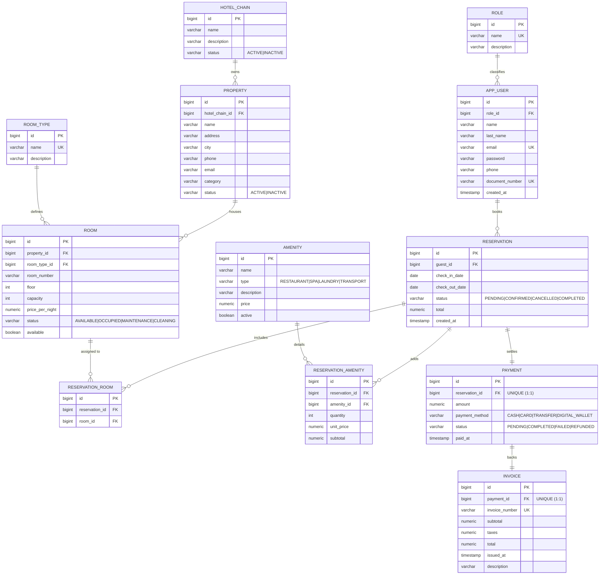

# Data Model

Entity-relationship diagram of the `hotel_pms` database. It mirrors the Flyway
migration `V1__create_tables.sql` and the constraints added in
`V2__constraints_and_indexes.sql`.

## ER diagram

## Relationships

| From | Cardinality | To | Description |
|---|---|---|---|
| `hotel_chain` | 1 : N | `property` | A chain operates several properties |
| `role` | 1 : N | `app_user` | A role groups several users |
| `property` | 1 : N | `room` | A property houses several rooms |
| `room_type` | 1 : N | `room` | A type classifies several rooms |
| `app_user` (guest) | 1 : N | `reservation` | A guest books several reservations |
| `reservation` ↔ `room` | N : M | through `reservation_room` | Several rooms per reservation |
| `reservation` ↔ `amenity` | N : M | through `reservation_amenity` | Extra services per reservation |
| `reservation` | 1 : 1 | `payment` | One payment per reservation (`uq_payment_reservation`) |
| `payment` | 1 : 1 | `invoice` | One invoice per payment (`uq_invoice_payment`) |

## Normalisation and constraints

- **3NF**: separate catalogues (`role`, `room_type`, `amenity`) and bridge tables
  (`reservation_room`, `reservation_amenity`) remove redundancy and direct N:M
  relationships.
- **Uniqueness**: `app_user.email`, `app_user.document_number`, `role.name`,
  `room_type.name`, `(room.property_id, room_number)`, `invoice.invoice_number`.
- **Controlled domains**: `CHECK` constraints mirroring the application enums
  (statuses, payment methods, amenity types).
- **Business rules**: `check_out_date > check_in_date`, non-negative amounts and
  quantities.
- **Indexes** on every foreign key for query scalability.

## A note on the `app_user` table

The table is called `app_user` rather than `user` because `USER` is a reserved
word in PostgreSQL. The JPA entity is still named `User`.
